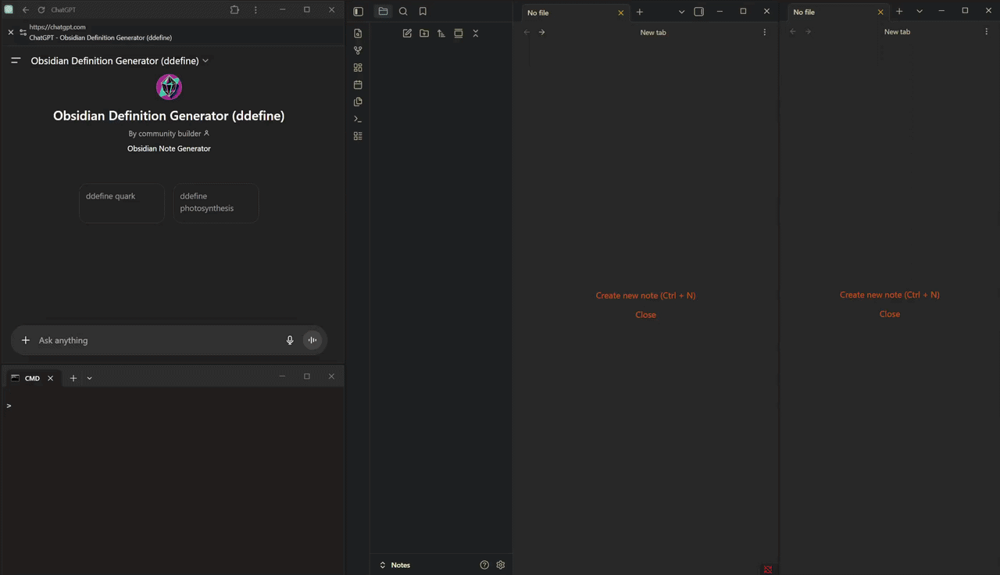

# GPT -> Obsidian Bridge

Automatically exports structured, command-triggered ChatGPT responses into Obsidian notes in real time.

## Demo

## Overview

This project integrates ChatGPT with Obsidian by pairing a custom GPT (responsible for response generation, formatting, and categorization) with a browser extension and a local WebSocket server that captures and writes responses as Markdown notes. 
The custom GPT defines the output format, while the extension and server handle transport, parsing, and note writing.
This enables ChatGPT to function as a structured, real-time note generation tool for knowledge management workflows.

## Core Concept

The system is built around a structured output contract between the custom GPT and the local pipeline.
 - The custom GPT produces consistently formatted markdown
 - The extension captures that output
 - The server processes and writes it into Obsidian
 - An undefined terms file (`_undefined.md`) is kept within each primary note category directory that tracks all "related terms" referenced in notes that are not yet defined. This file is automatically updated upon the inclusion of new notes to reflect both newly defined and newly undefined notes.

The extension communicates with the server only when a ChatGPT response contains a specific sentinel.
Because of this, it is necessary that this system is used with the correct custom GPT (linked below) that is configured to include this sentinel at the end of messages. 

## Architecture

[Custom GPT] -> [ChatGPT UI] -> [Browser Extension] -> [WebSocket Server] -> [Obsidian Vault]

### Components
- **Custom GPT**
  - Enforces output format (headers, tags, structure)
  - Categorizes responses by content
  - Ends formatted responses with end-of-message sentinel
- **Browser Extension**
  - Detects end-of-message sentinel
  - Extracts ChatGPT response
  - Sends structured data to server
- **WebSocket Server (Python)**
  - Receives messages from extension
  - Parses and validates structured output
  - Writes markdown files to specified vault and subfolder
  - Updates undefined terms list (`_undefined.md`) to remove newly defined terms and add newly undefined terms

## Tech Stack
 - **Frontend:** Browser Extension (JavaScript)
 - **Backend:** WebSocket Server (Python)
 - **Communication:** WebSockets
 - **Formatting Engine:** Custom GPT
 - **Target:** Obsidian (Markdown-based)

## How it Works
0. Install the extension and launch the WebSocket Server: `python bridge.py "[PATH TO VAULT]" "[NOTE CATEGORY]"` 
   - (e.g. `python bridge.py "C:\Obsidian\Vaults\Notes" "Physics"`)
1. User enters a formatted command into ChatGPT (custom GPT): `ddefine [TERM]` (e.g. `ddefine Quark`)
2. The custom GPT generates a structured markdown response
3. The browser extension captures the response
4. The extension sends the content to the WebSocket server
5. The server processes and writes a `.md` file, and updates `_undefined.md` with any undefined terms present within the newly created note
   - One `_undefined.md` file exists for each `[NOTE CATEGORY]` folder.
   - If the path to the `[NOTE CATEGORY]` folder does not exist, it is first created before the note and `_undefined.md` are added.
   - The GPT response specifies a secondary category that is used to create an additional folder within the `[NOTE CATEGORY]` folder that holds the written note.
6. The new note and updates to `_undefined.md` are automatically present within Obsidian

## Custom GPT Requirement

[This system relies on this custom GPT to produce parseable, structured output.](https://chatgpt.com/g/g-69c0babc7d708191b213c8a8b397d111-obsidian-definition-generator-ddefine)

### Custom GPT Responsibilities
 - Generate markdown output
 - Include tags, aliases, category of note, and ending sentinel
 - Include headings, note content, and related terms
 - Maintain predictable formatting for parsing

## Setup
### 1. Clone repository
### 2. Load browser extension into Chrome
 - Chrome -> Extension -> Manage Extensions -> Load Unpacked -> Select extension folder
### 3. Run WebSocket server
 - `python bridge.py "[PATH TO VAULT]" "[NOTE CATEGORY]"` (e.g. `python bridge.py "C:\Obsidian\Vaults\Notes" "Physics"`)
### 4. Open custom GPT within Chrome

## Usage
### 1. Ensure that the custom GPT is being used
### 2. Enter the `ddefine` command with a term: `ddefine [TERM]` (e.g. `ddefine Quark`)
### 3. After the response is completed, it is automatically created within the specified Obsidian vault and folder.

## Design Decisions
 - Custom GPT as a formatting layer
   - Using GPT as a formatting and categorization engine on top of a response generator is extremely powerful and enables better organization and formatting
   - Most of the formatting is handled by GPT, allowing the server to focus on cleanup and file writing/updating
 - WebSockets for communication
   - Enables real-time transfer between the browser extension and the note writing system

## Status
**Active Development**

Used as a personal workflow tool and is under active development

## Future Work
 - More command types
 - Expanded `ddefine` syntax (support for defining multiple terms at once)
 - Bi-directional integration

## Notes
Developed with assistance from AI tools (OpenAI Codex).
System architecture, design decisions, and overall structure were independently created. The codebase is understood and maintainable. 

